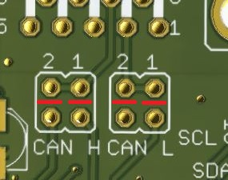

# Back to the future
Our intelligence suggests that the DeLorean we previously recovered is capable of time travel.
According to the documents in our possession the time travel functionality is activated as soon as a specific ECU within the vehicle maintains a velocity of exactly 88 miles per hour for at least a few seconds. We rely on your CAN bus expertise to trick the time-travel ECU into thinking it is travelling at the right speed; again, the vehicle dashboard we restored should be of use.

Best of luck.

The Dashboard app is available here.

Challenge developed by Argus Cyber Security.

## Write-up
For this challenge I started logging the CAN BUS traffic using the same configuration of CAN Opener [(CAN setup)](../CANOpener/CAN_Configuration.md) with speed 50Kbps. The packets are similar to the CAN Opener, so using the dashboard.py we can identify the meaning of most of the data:
```
ID: 0x12
LEN: 2
061A = ?? some kind of counter...
```
```
ID: 0x23
LEN: 5
0027 = MHP SPEED
080C = RPM
10 = ?? (or 20)
```
```
ID: 0x19A
LEN: 2
7110 = Indicator or (7120) (the 10 or 20 matches with the data of ID 23 packet)
```
```
ID: 0x10C
LEN: 8
004A = TEMPERATURE
011D = MAF
0049 = ??
004A = ??
```
```
ID: 0x1BF
LEN: 6
000C = BATERY
000E = ??
000C = ??
```
```
ID: 0x202
LEN: 5
0048 = AAC
004A = TEMPERATURE
52 = ?? (Always 52)
```

The packets with ID 23 are who have the speed, but sending to the CAN bus packets with ID 23 and speed 88mph is not enough. The original packets with different speed are still sent between ours.

I was some time trying to flood the CAN BUS with my packets, forcing errors in the CAN BUS... all with the purpose of remove or invalidate packets with other speeds. But it seems not work, even when dashboard shows a constant speed of 88mph.

To remove the original packets we need to cut the lines that join the two MCP of the board. I took long time to see it because in the schematics these lines don't exists.  


After cut the lines and connecting our Arduino to each of the CAN buses, we can see
CAN 1 sends packets of ID 19A, 023 and 202
CAN 2 sends packets of ID 012, 10C and 1BF

We send packets with ID 23 and speed 88 mph (0x58) to CAN 2 but still doesn't work, the check engine light is on. After a few test we discover that this light is shut down when we send a packet with ID 19A. After send both packets (23 and 19A) during some seconds we get the flag
```
36 20 3630663436636237636161326233653734303834303037343734323066356230
FLAG: 60f46cb7caa2b3e7408400747420f5b0
```

[Here](BackToTheFuture.ino) is the Arduino script I used.

I used two CAN Shields with the Arduino to connect the both CAN BUS at the same time, because when one is open the ECU stopped to work after few packets.  The connections are
```
CS CAN0 = PIN 10 of Arduino
INT CAN0 = PIN 2 of Arduino
CS CAN1 = PIN 9 of Arduino
INT of CAN1 = PIN 4 of Arduino
SCK, MISO, MOSI, VCC, GND common to both CAN = PINs 13, 12, 11 VCC and GND of Arduino
```


