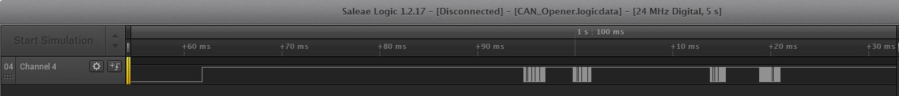
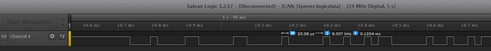

# CAN opener
Our operatives have recovered a DeLorean in the ruins of an old mid-west US town. It appears to be locked, but we have successfully accessed its internal communications channels. According to the little data we have, the DeLorean internally uses an archaic technology called CAN bus. We need you to analyze the communications and find a way to unlock the vehicle; once unlocked, recover the secret flag stored inside. We have reason to believe that vehicle entry should be a fairly easy challenge, but to aid you in this, we have restored and reconnected the vehicle dashboard.

Best of luck.

The Dashboard app is available here.

Challenge developed by Argus Cyber Security.

## Write-up
To resolve this CAN challenge I used the setup described [here](CAN_Configuration.md)

1. First of all we can read the line CAN L with a logic Analyzer to determine the speed used. We will see that the smaller time bit is 20\mus, so the speed of CAN BUS is 50Kbps  
  


2. We configure the Arduino to use this speed and read the packets in the bus. Quickly we will see packets for 5 IDs
```
Standard ID: 0x023       DLC: 5  Data: 0x00 0x20 0x07 0xBC 0x10
Standard ID: 0x10C       DLC: 8  Data: 0x00 0x4A 0x01 0x22 0x00 0x49 0x00 0x4A
Standard ID: 0x1BF       DLC: 6  Data: 0x00 0x0C 0x00 0x0E 0x00 0x0C
Standard ID: 0x202       DLC: 5  Data: 0x00 0x49 0x00 0x4A 0x52
Standard ID: 0x332       DLC: 8  Data: 0x6C 0x6F 0x63 0x6B 0x00 0x00 0x00 0x00
```

3. At the same time we check the values in the serial port (these messages are used by the dashboard.py to print the data)
```
E824F65A 3330 3032 32333030 -> 30 02 2300 -> MPH_OP - 35
E824F65A 3331 3032 46383037 -> 31 02 F807 -> RMP_OP - 2040
E824F65A 3332 3032 34423030 -> 32 02 4B00 -> Temp_OP - 75
E824F65A 3335 3032 31463031 -> 35 02 1F01 -> MAF_OP - 287
E824F65A 3333 3032 30443030 -> 33 02 0D00 -> Batt_OP - 13
E824F65A 3334 3032 34413030 -> 34 02 4A00 -> AAC_OP - 74
```

3. If we look the data in the CAN BUS messages, we will see that ID 332 has the message "lock"

4. We send to the CAN Bus a message to ID 332 but with data "unlock"

5. In the serial port we receive a new message
```
E824F65A 3336 3230 36313336363533393338333836343632333236343335333336323634333536343636333836363634333936313336363636333335363133323336333836343332 -> 36 20 6136653938386462326435336264356466386664396136666335613236386432 
```

6. It is the Flag (a6e988db2d53bd5df8fd9a6fc5a268d2). If I would have the dashboard open I would see written in the screen also.

[Here](CAN_Opener.ino) is the Arduino script I used to read CAN BUS and send the "unlock" message