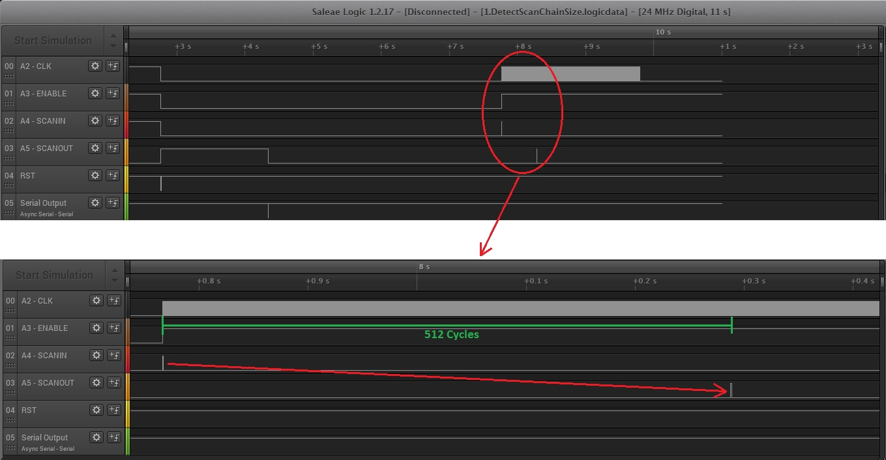
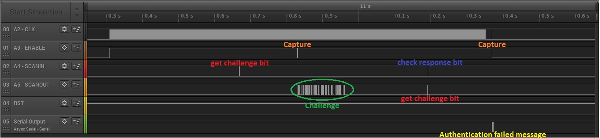

# Car Key Fob hardware backdoor
We reverse engineered the firmware of a key-fob we found. There is an indication that there is a backdoor in a hardware module through a scan-chain that provides access to all the cars. It appears to use pin 1, 2, 43, and 44 from the chip. It also has a challenge-response mechanism of 128-bits. A list of ~~possible password candidates~~**elements with which the password could be constructed** is found in the firmware and printed below.

PS. The scan-chain is emulated in software. Therefore, the worst case branch takes around 0.54 ms, and therefore you shouldn't drive the clock faster than 1.8 khz.

**PPS. The Encryption used by this key-fob is very Advanced.**

**PPPS. Remember that the bits in the output of the scan chain come in reverse order. Also, the location for the provided ciphertext is different from the one where the challenge is received.**
```
princess
fob
qwerty
secr3t
admin
backdoor
user
password
letmein
passwd
123456
administrator
car
zxcvbn
monkey
hottie
love
userpass
wachtwoord
geheim
secret
manufacturer
tire
brake
gas
riscurino
delft
sanfransisco
shanghai
gears
login
welcome
solo
dragon
zaq1zaq1
iloveyou
monkey
football
starwars
startrek
cheese
pass
riscure
aes
des
```

## Write-up
This was the challenge where I spent more time, also I had the board busy with this challenge and I couldn't  dedicate to try to resolve other challenges. The reason... it had some bugs and the description had few info about the algorithm for challenge response, so I had many algorithms to test.

### First version
- First step was identify the pins used. 
  - PINS 1, 2, 43, 44 of AT are connected to A2, A3, A4 and A5 in the board.
  - A2, A3, A4 are INPUTs, and A5 is OUTPUT so it must be the SCANOUT of the scan-chain. 
  - After a few test we obtain
```
A2 - CLK
A3 - ENABLE
A4 - SCANIN
A5 - SCANOUT
```
- To communicate with this scan chain I prepared a Arduino script (based in [JTAGduino](https://github.com/balau/JTAGduino)). At the end of the write-up you can find it. The connections between the board and the Arduino were
```
A1(Arduino) - A2(board)
A2(Arduino) - A3(board)
A3(Arduino) - A4(board)
A4(Arduino) - A5(board)
A5(Arduino) - RST(board)
GND(Arduino) - GND(board)
```
- To discover the scan-chain length we can write one bit "1" to the SCANIN and wait until it appears in the SCANOUT. It needs 512 CLK so the length of scan-chain is 512 


- After knowing the size of the scan chain, we have to try to identify the positions inside the scan chain. We do 512 tests, one for each position of the scan chain
  - Do the SCANIN stage writting only one value "1" in the position we want to test
  - Do CAPTURE (sending one pulse in ENABLE line)
  - Do the SCANOUT stage and check the result
- The results:
  - bits 51 and 61 produces a message "Self-destruct triggered." in the Serial output
  - bit 157 writes the challenge in the last 128 bits of scan-chain
  - There are 43 bits that we cannot set to one. We scan-in one "1" but we always read a "0" in the scan-out.  


- Repeating the previous tests, but now after obtain the challenge we obtain this extra result: 
  - bit 156 produces a message "Authentication failed" in the Serial output.

- The 43 bits "fixed" to zero, don't give us a free space of 128 bits to write the response of the challenge. So I thought that we should write the response at the position where the challenge is read (Later we will see that it is incorrect, they fixed it and removed 7 of these bits, giving us other valid space to write the response)
  
- We have all identified but we don't know the challenge-response algorithm used. So, I started a bruteforce with many algorithms and all the passwords... HMAC, PBKDF1, PBKDF2, AES, DES, SHA1, MD5, SHA256 with many variants, using hashes to derivate a key from the password... nothing worked, always "Authentication failed"
  
  
### Fixed version and new hints
- Here we had two interesting new hints:
  - The Encryption used by this key-fob is very Advanced.
  - They changed ~~possible password candidates~~ by "elements with which the password could be constructed"
- First hint make me think that we have to use an "AES Encryption" because it say "Encryption" and "Advanced", and the second hint tell us that we have to use at least two passwords to generate the key.

- With this new hints I tried again the same bruteforce but only with the algorithm "AES Encryption". The only doubt is how to generate the key, I tried different algorithms combining two plain password, only concatenating two plain passwords, using advanced algorithms like PBKDF1, PBKDF2 and many schemes like MD5(MD5(pass).salt), MD5(salt.MD5(pass)), MD5(MD5(salt).MD5(pass))... At this time I still was writing the response at the same position of challenge, so I hadn't success

- Already hopeless, I repeated all the test from the beginning and I had a surprise... the 43 bits "fixed" to zero now were 36, there were another valid space where we could write the response. Here are 4 example of the entire scan-out when the scan-in was all "1" except the two self destruction bits.
```
FFFF FFFF FFFF EFFB FFFF A7CD FFFF FFFF 422A FFFF FFFFFFFFFFFFFFFFFFFFFFFFFFFFFFFF FFFF 38E0 FFFF FFFF EE58 FFFF 147BAA4188AE7BC0C2FFCA60E9E177F2
FFFF FFFF FFFF EFFB FFFF A7CD FFFF FFFF 422A FFFF FFFFFFFFFFFFFFFFFFFFFFFFFFFFFFFF FFFF 38E0 FFFF FFFF EE58 FFFF 308E2A9AA897632AE1B87C0683118703
FFFF FFFF FFFF EFFB FFFF A7CD FFFF FFFF 422A FFFF FFFFFFFFFFFFFFFFFFFFFFFFFFFFFFFF FFFF 38E0 FFFF FFFF EE58 FFFF 0938AD55938C9B8B77B901DD2501ABF7
FFFF FFFF FFFF EFFB FFFF A7CD FFFF FFFF 422A FFFF FFFFFFFFFFFFFFFFFFFFFFFFFFFFFFFF FFFF 38E0 FFFF FFFF EE58 FFFF D5CB8DF2B17316FCF9F522C2FA3E6BC5
               |  |                             |
               |  4=bit61=Self Destruction      4=bit157=getChallenge
               1=bit51=Self Destruction         8=bit156=sendPassword
```
- The response has a valid space from position 158 to 178. Probably it must be in 160 due to symmetry with the part of the challenge.

- Repeating the bruteforce with this new position we observe something strange. After the password corresponding to "caradministrator" key, we obtain an empty challenge.
```
...
Challenge: DFD2E2082DAB9836CEC9EE6560D544E5 (fobadministrator)
Sending Password: 53364A871DD5BC24CE7C6962671D0114
Challenge: 27CD83D54A384FC2CEF63A2403CFF9B4 (caradministrator)
Sending Password: A0FE038F79EDDD601085D5C35AB6DF6E
Challenge: 00000000000000000000000000000000 (gasadministrator)
Sending Password: F0FC8C0999661DB19B8ECEAB94BCD9BE
Challenge: 60D5297437DA1F9B8B9364B697258D47 (aesadministrator)
Sending Password: FFFDA5F875597715D408D5B1245F33C3
Challenge: 4A8196235A88F1F97E3FC7C76E4E9635 (desadministrator)
Sending Password: D7657D436FDF6464EDBB295368395FE2
...
```
- If we look also the Serial output, we haven't the message "Authentication failed".
```
...
Challenge: DFD2E2082DAB9836CEC9EE6560D544E5 (fobadministrator)
Sending Password: 53364A871DD5BC24CE7C6962671D0114                Authentication failed -> Test mode activated
Challenge: 27CD83D54A384FC2CEF63A2403CFF9B4 (caradministrator)
Sending Password: A0FE038F79EDDD601085D5C35AB6DF6E								
Challenge: 00000000000000000000000000000000 (gasadministrator)
Sending Password: F0FC8C0999661DB19B8ECEAB94BCD9BE                Authentication failed -> Test mode activated
Challenge: 60D5297437DA1F9B8B9364B697258D47 (aesadministrator)
Sending Password: FFFDA5F875597715D408D5B1245F33C3                Authentication failed -> Test mode activated
Challenge: 4A8196235A88F1F97E3FC7C76E4E9635 (desadministrator)
Sending Password: D7657D436FDF6464EDBB295368395FE2                Authentication failed -> Test mode activated
...
```
- Trying more times we have always the same result. After send the password of "caradminsitrator" we haven't the message "Authentication failed". What's happening? 

- We read the complete scanout and we find another value where before was the challenge. If we repeat the test we have always the same value
```
Sending reset...
Challenge: C3D76991885EAF031C1EAFAB5FD9EF92 (caradministrator)
Sending Password: 73D5556F88AA4E00D918D63033487DD2
Result: 000000000000000000000000000000000000000873D5556F88AA4E00D918D63033487DD200000000000000000000000059C333AA3723128DA8CF63EFC74E1230

Challenge: 381A82DAC129CE388264A00B1506AC48 (caradministrator)
Sending Password: 5F8E86798D3223D23A0EEE281B5523B9
Result: 00000000000000000000000000000000000000085F8E86798D3223D23A0EEE281B5523B900000000000000000000000059C333AA3723128DA8CF63EFC74E1230

Challenge: 614F6C9BD292410A2E08B54FDA8A3401 (caradministrator)
Sending Password: C67B15106BFD5B763E9225BB11BA2953
Result: 0000000000000000000000000000000000000008C67B15106BFD5B763E9225BB11BA295300000000000000000000000059C333AA3723128DA8CF63EFC74E1230

Challenge: 91EDB212E67D975631D852C514384016 (caradministrator)
Sending Password: FD86DD345F2AC601EF4C603DFCFF4447
Result: 0000000000000000000000000000000000000008FD86DD345F2AC601EF4C603DFCFF444700000000000000000000000059C333AA3723128DA8CF63EFC74E1230
```
- The correct flag is: 59C333AA3723128DA8CF63EFC74E1230 so finally it was a AES Encrypt with key **caradminsitrator** written at position 160.
 
### Script
I prepared [this script](KeyFobBackdoor.ino) to communicate the PC with the scan chain. I invented a simple protocol to send and read from scan chain
 - 00 - Reset the board
 - 01 - Get Challenge
 - 02 xxxxxxxxxxxxxxxxxxxxxxxxxxxxxxxx - Send response
 - 04 xxxx - Set offset of response inside the scan chain
 - 05 - Get complete scanout
 - 06 - Test scan-chain: do a full 1 scanin, except the two Self destruction bits, and get scan-out

The script has commented some parts used before to determine scan-chain length, and other tests.
 
this is the C# code to obtain the flag
```cs
SerialPort COM = new SerialPort();
COM.PortName = "COM8";
COM.BaudRate = 115200;
COM.DataBits = 8;
COM.Parity = Parity.None;
COM.StopBits = StopBits.One;
COM.Open();

COM.Write(new byte[] { 0x00 }, 0, 1);   //Reset
Thread.Sleep(3000);

COM.Write(new byte[] { 0x04, (byte)(160 >> 8), (byte)160 }, 0, 3); //Set offset of response

COM.Write(new byte[] { 0x01 }, 0, 1); //Get challenge
byte[] tempChallenge = new byte[32];
for (int i = 0; i < tempChallenge.Length; i++) tempChallenge[i] = (byte)COM.ReadByte();
byte[] challenge = stringtobyte(HEXtoASCII(tempChallenge));

byte[] key = ASCIItoHEX("caradministrator");
byte[] password = AesEncrypt(challenge, key);

COM.Write(new byte[] { 0x02 }, 0, 1); //send response
COM.Write(password, 0, 16);
Thread.Sleep(100);

COM.Write(new byte[] { 0x05 }, 0, 1); //read complete scanout
byte[] result = new byte[128];
for (int i = 0; i < result.Length; i++) result[i] = (byte)COM.ReadByte();       //values
result = stringtobyte(HEXtoASCII(result));

COM.Close();
```
 
And this is an example of the code used to bruteforce
```cs
string[] claves = { 
		/* 13 */ "administrator", 
		/* 12 */ "manufacturer","sanfransisco",
		/* 10 */ "wachtwoord",
		/*  9 */ "riscurino",
		/*  8 */ "princess","backdoor","password","userpass","shanghai","zaq1zaq1","iloveyou","football","starwars","startrek",
		/*  7 */ "letmein","welcome","riscure",
		/*  6 */ "qwerty","secr3t","passwd","123456","zxcvbn","monkey","hottie","geheim","secret","dragon","monkey","cheese",
		/*  5 */ "admin","brake","delft","gears","login",
		/*  4 */ "user","love","tire","solo","pass",
		/*  3 */ "fob","car","gas","aes","des"
	  };

SerialPort COM = new SerialPort();
COM.PortName = "COM8";
COM.BaudRate = 115200;
COM.DataBits = 8;
COM.Parity = Parity.None;
COM.StopBits = StopBits.One;
COM.Open();

COM.DiscardOutBuffer();
COM.DiscardInBuffer();

tresul.Text += "Sending reset...\r\n";
COM.Write(new byte[] { 0x00 }, 0, 1);   //Reset
Thread.Sleep(3000);

for (int algo = 0; algo < 1; algo++)
{
	tresul.AppendText("ALGO: " + algo + "\r\n");
	ushort[] offsets = { 160 };
	foreach (ushort offset in offsets)
	{
		COM.Write(new byte[] { 0x04, (byte)(offset >> 8), (byte)offset }, 0, 3);
		tresul.AppendText("OFFSET: " + ushorttostring(offset) + "\r\n");
		foreach (string c1 in claves)
		{
			foreach (string c2 in claves)
			{
				string c = c1 + c2;
				if (c.Length != 16) continue;
				byte[] key = ASCIItoHEX(c);

				COM.Write(new byte[] { 0x01 }, 0, 1);
				byte[] tempChallenge = new byte[32];
				for (int i = 0; i < tempChallenge.Length; i++) tempChallenge[i] = (byte)COM.ReadByte();

				byte[] challenge = stringtobyte(HEXtoASCII(tempChallenge));
				tresul.AppendText("Challenge: " + bytetostringsines(challenge) + " (" + c + ")\r\n");

				byte[] password = AesEncrypt(challenge, key);

				tresul.AppendText("Sending Password: " + bytetostringsines(password) + "\r\n");
				COM.Write(new byte[] { 0x02 }, 0, 1);
				COM.Write(password, 0, 16);
				Thread.Sleep(100);
			}
		}
	}
}

COM.Close();
```
