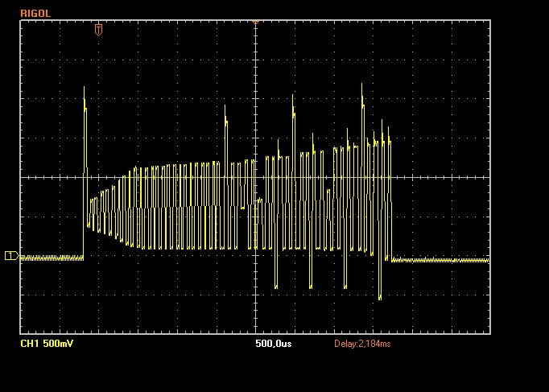

# Full Compromise
An attacker managed to hack our CI server and sign+encrypt his malicious code in a ECU firmware, that is now running in millions of cars and doing Chaos knows what. To stop the attackers, we must know what the malicious code is doing. We have a history of all binaries signed by the server on the day of the hack, and a device running the attacker's firmware. Help us find which sample was provided by the attacker and get access to its management interface.

## Write-up
This challenge has 1000 hex files and we don't know which is the loaded in the board. We start to reverse the sample 0...

1. In the reversing we will find the function at 5B29, this has two possible commands ("test" and "risc") and it seems to write data in the DACB. So we check pin D7 of the board with the oscilloscope and we  find that it writes some kind of pulses. Examples  



2. If we repeat the commands, we will see that the output is always the same, except 10 variable pulses. Sometimes they have a higher voltage and sometimes a lower voltage. Here are 8 diferent captures [1.jpg](1.jpg), [2.jpg](2.jpg), [3.jpg](3.jpg), [4.jpg](4.jpg), [5.jpg](5.jpg), [6.jpg](6.jpg), [7.jpg](7.jpg), [8.jpg](8.jpg)

3. If we continue the reversing we will see that function 55BD generates an array of 0x64 bytes, and this array is used to modify the voltage of some pulses... It modifies 10 pulses according to the parity of 10 consecutive bytes inside the array. The offset used to get the 10 bytes is random every execution. This is the reverse code that modifies each pulse voltage
```cs
d = data[x]
if ((d & 0x01) == 0x01)
{
	i += 0x2AA; //odd = high voltage
}
else
{
	i -= 0x02AA; //even = low voltage
}
```

4. It can be used to determine which sample is the loaded in the board, but to do this we need generate the array of 0x64 bytes of each sample. To do this task I used my atmel simulator adding loop of code to do this:
   - Load sample X
   - Search the address where the function to generate array starts
   - Set PC to this address
   - Execute until the end
   - Dump memory and write to a file

   [Here](1000_DACBData.txt) is the file with the data of the 1000 samples (1000_DACBData.txt). Each line is the array of one sample.  
   [Here](1000_DACBData_parities.txt) is the same file, but storing only the parity of bytes (00=even 01=ood). (1000_DACBData_parities.txt)

5. With the oscilloscope traces and the arrays calculated, we can easily determine which is the correct sample. We calculate the real parities from the traces and search these sequences in 1000_DACBData_parities.txt. We will find that only line 792 (Sample 791) contains all the parity sequences.
```
Trace 1: 01 01 00 00 01 00 00 00 01 00
Trace 2: 01 00 01 01 01 00 01 01 01 00
Trace 3: 01 00 00 00 01 00 01 01 01 01
Trace 4: 01 01 01 00 01 01 00 01 00 01
Trace 5: 00 00 00 01 00 01 00 00 01 00
Trace 6: 00 00 00 00 00 00 00 01 01 00
Trace 7: 00 01 00 01 00 00 01 00 01 00
Trace 8: 00 00 00 00 00 00 00 01 01 00
```
```
Array line 792 (Sample 791):
58A52DC614FE88F7B9E9B090A7C9ABE0F650FC07F112AA949340EB3E8671E20FE88D43D94AE73F0BEC2FB5EC598E55A392123DF993FB191A8C562D32905A660A5CC88ECD21FC34B9C461BAB8ED9D352E2C5BAF97F6120AB73CF5BF7B619A4A3D1C522CB1

Parities line 792 (Sample 791):
00 01 01 00 00 00 00 01 01 01 00 00 01 01 01 00 00 00 00 01 01 00 00 00 01 00 01 00 00 01 00 01 00 01 01 01 00 01 01 01 00 01 01 00 01 00 01 01 00 00 01 01 01 01 01 00 00 00 01 00 00 00 00 00 00 00 00 01 01 00 00 01 00 01 00 00 01 01 01 00 00 01 01 01 00 00 00 01 00 01 01 01 01 00 00 01 00 00 00 01 
````

6. Continuing the reverse we will see we need to send a 0xFA length password to get the flat. This password is generated in memory and is diferent for each sample.

   [Here](1000_Passwords.txt) is a file with the password of the 1000 samples (1000_Passwords.txt). I generated this using the same strategy of step 4.  
   [Here](GeneratingPassword.md) is the reverse code that generates the password with the data of Sample 0

7. The password of sample 791 is this
   ```
0F79D2CC6501B51A4F3B343DEEF9AC52B5F3726C8EAF947CAC81778B2D56C1CA76E9DB6D66EEA8604C9E80913E709CA2BC1AB8802890B96EEAD18DD3D1656185F37213BD892A90A5A25889580EC93BA8A44C1E6691C590ADB28CA10EB029905B01DE7374551B33E9D12A1DCFC3770D6EDC5C72013328FB7DD5E3ECA91C30690EFD772969787E59BDB6FB595FC85486B4242F3DB97635D6CD2A8458DE92B98D6259B1F566F7E0830F1F34BD4D3234E37297C868C1F07B7DB036D513F9A0643F401D9F713FD583ADD677FD48171BB3F5FC55F4E4E64C290C5CD6A9AC72A9D245DD4E90D886F927FB366836AF784F138E255321ACE60BA1B43ACB61
```
   but the way to send this is very strange. First of all we have to send "\*". After that, it doesn't store the bytes sent... the board counts the number of data received and store this counter when there is a long time without receive more bytes. Finally we have to write another "\*". Example:
   - send "\*"
   - send 0x0F bytes (any values)
   - wait
   - send 0x79 bytes (any values)
   - wait
   - ...
   - wait
   - send 0x61 bytes (any values) 
   - wait
   - send "\*" 

   Here is the code I prepared to send the password (after some tests I determined that a good time of waits was 6 seconds, with smaller values sometimes I had some errors in the values I wanted to write)
```cs
private void sendPassword(byte[] pwd)
{
	COM.Write("*\n");
	for (int i = 0; i < pwd.Length; i++)
	{
		int val = pwd[i];
		if (val == 0) val = 0x100;

		for (int j = 0; j < val; j++)
		{
			COM.Write("1");
		}
		Thread.Sleep(6000);
	}
	COM.Write("*");
}
```

8. After some hours sending (and the board processing) the password. We get the flag 
```
Starting...

Welcome to the maintenance interface.
Type 'test' to run analog test.
*

You entered the following string: 
0x0F79D2CC6501B51A4F3B343DEEF9AC52B5F372
6C8EAF947CAC81778B2D56C1CA76E9DB6D66EEA8
604C9E80913E709CA2BC1AB8802890B96EEAD18D
D3D1656185F37213BD892A90A5A25889580EC93B
A8A44C1E6691C590ADB28CA10EB029905B01DE73
74551B33E9D12A1DCFC3770D6EDC5C72013328FB
7DD5E3ECA91C30690EFD772969787E59BDB6FB59
5FC85486B4242F3DB97635D6CD2A8458DE92B98D
6259B1F566F7E0830F1F34BD4D3234E37297C868
C1F07B7DB036D513F9A0643F401D9F713FD583AD
D677FD48171BB3F5FC55F4E4E64C290C5CD6A9AC
72A9D245DD4E90D886F927FB366836AF784F138E
255321ACE60BA1B43ACB61

Processing password, this will take a while.
0% complete...1% complete...2% complete...3% complete...4% complete...5% complete...6% complete...7% complete...8% complete...9% complete...10% complete...11% complete...12% complete...13% complete...14% complete...15% complete...16% complete...17% complete...18% complete...19% complete...20% complete...21% complete...22% complete...23% complete...24% complete...25% complete...26% complete...27% complete...28% complete...29% complete...30% complete...31% complete...32% complete...33% complete...34% complete...35% complete...36% complete...37% complete...38% complete...39% complete...40% complete...41% complete...42% complete...43% complete...44% complete...45% complete...46% complete...47% complete...48% complete...49% complete...50% complete...51% complete...52% complete...53% complete...54% complete...55% complete...56% complete...57% complete...58% complete...59% complete...60% complete...61% complete...62% complete...63% complete...64% complete...65% complete...66% complete...67% complete...68% complete...69% complete...70% complete...71% complete...72% complete...73% complete...74% complete...75% complete...76% complete...77% complete...78% complete...79% complete...80% complete...81% complete...82% complete...83% complete...84% complete...85% complete...86% complete...87% complete...88% complete...89% complete...90% complete...91% complete...92% complete...93% complete...94% complete...95% complete...96% complete...97% complete...98% complete...99% complete...100% complete...
Secret management interface accessed! Thank you for knocking :)
Your flag is: 5526eff03601bee33c358ae1f9b482d5
```