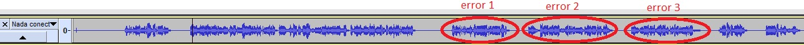
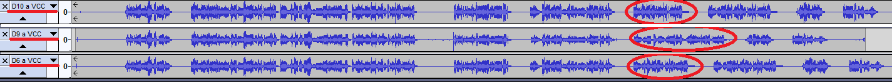
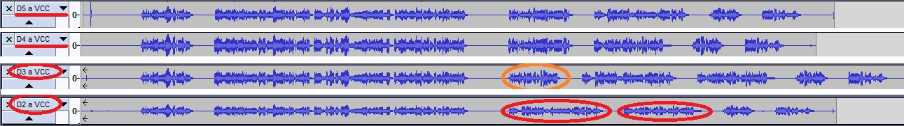
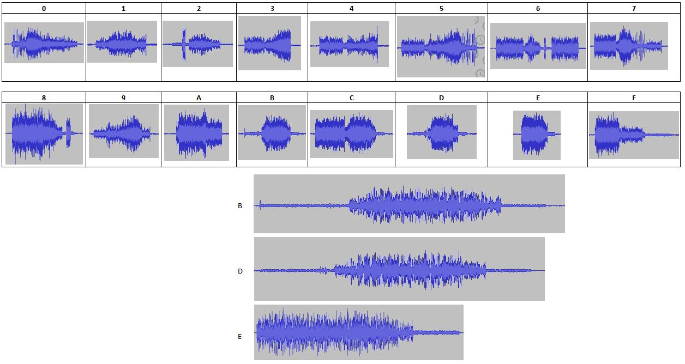

# Phonic Frenzy 2
Hmm, when registering your serial number on the website, you saw that there is also an 'upgraded' version of the infotainment center available with better options for everything! And better yet, apparently the only difference between the two systems is that the upgrade has some kind of wiring harness that needs to be connected to enable the extra functionality. Maybe we can rig up something ourselves in order to unlock this functionality?

## Write-up
Another phonic challenge... when we connect the speaker or headphones to D7(or D8) and GND, we hear the same kind of low quality audio of phonic frenzy 1. But this time we haven't the flag, we have a long message saying some errors. I couldn't understand many of the error messages but I can record it. The waveform in the Audacity is this:


We need to do the wiring harness, so the first step is determine what pins of the board are input and outputs...
- From A0 to A5 and AREF are OUTPUTs and has the same pulses waveform as phonic frenzy 1
- D7/D8 have the audio signal
- From D13 to D9 and from D6 to D2 are all INPUTs

I started setting VCC and GND to the different INPUT PINs to see if the message change, these were the results
```
D13 <-> VCC = No change
D13 <-> GND = No change
D12 <-> VCC = No change
D12 <-> GND = No change
D11 <-> VCC = No change
D11 <-> GND = No change
D10 <-> VCC = Add a new error to the message
D10 <-> GND = No change
D9 <-> VCC = Modify the message of error3
D9 <-> GND = No change
D6 <-> VCC = Add a new error to the message
D6 <-> GND = No change
D5 <-> VCC = Error 3 disappears
D5 <-> GND = No change
D4 <-> VCC = Error 2 disappears
D4 <-> GND = No change
D3 <-> VCC = Error 1 changes
D3 <-> GND = No change
D2 <-> VCC = Error 1 disappears but appears two new errors
D2 <-> GND = No change
```



I couldn't understand most of the errors, only three related with some clock signal and seems to be controlled by pins D2 and D3.
- "Unexpected clock frequency detected"
- "Clock frequency does not match the inverse"
- "Inverted clock frequency is inconsistent"

I did some test with an Arduino connected to D2/D3 and generating two CLK signals. Changing the frequencies, the gap between two CLK signals... nothing worked. I always had some error message.

Then I looked again at the PINs of the board, and, when audio is silent, the Ax PINs have some interesting waveforms...
```
A0 - It has a CLK
A1 - it has GND
A2 - It has GND
A3 - It has GND
A4 - It has GND
A5 - It has VCC
AREF - it has a CLK (inverse of A0)
```
AREF and A0 are two CLK, and they are inverse!. So I removed the Arduino and I started to test connecting only wires from some Ax pins to Dx pins

The first error in the audio is "Inverted clock frequency is inconsistent"
- If we connect AREF to D3 the error change to: Clock frequency does not match inverse
- If we connect AREG to D2 the error disappears

We try connecting the other Ax PINs to different Dx PINs
 - A1 and A5 connected to D4 and D5 removes the errors 1 and 2
 - A4 connected to D10 removes other error, but appears "Unexpected clock frequency detected"
 - A0 connected to D3 removes these last error and we get the flag!!!

Finally the correct connections were
```
AREF <-> D2
A0 <-> D3
A1 <-> D4
A4 <-> D10
A5 <-> D5
``` 
Here are some waveforms of the process, the last is the flag


The serial output changed to
```
Welcome to the Infotainment Center.
The secure hardware interface has been detected.
The wiring harness has been properly connected.
Please enter the serial number online to
fully activate your upgraded in-car infotainment system.
The system must be activated before proceeding.

Thank you.


The system will reboot now.
```

We can get the flag like in phonic frenzy 1. This time was easy because I had already the waveforms identified:
Flag: F59B0DA73D15B27ED78E17CE4767A010


I prepared this "alphabet" of waveforms.

- It is recorded putting the headphone near the speaker of the laptop. Using a direct cable to the speaker input the waveforms are different. 
