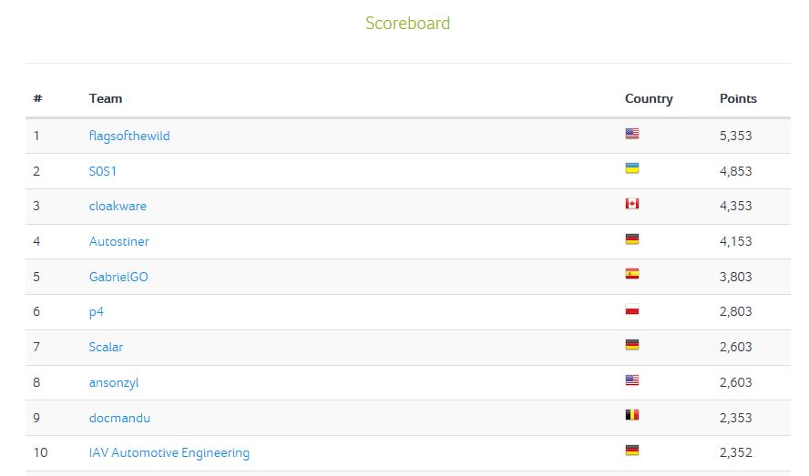

# RHme3
It was August 2017 and a friend talked me about a challenge created by [Riscure](https://www.riscure.com/), it was the [RHme3](https://rhme.riscure.com/3/news) qualifications. I was searching some fun and this caught my attention, besides, I could win a Arduino-compatible board.

I spent some funny time and I could resolve the 3 challenges :smiley:

At this time I still thought I couldn't resolve many challenges of the main stage. But 5 months later, when main challenges were published and I checked them, I was happy because I saw that I could have opportunity of resolve several challenges.

After three months playing with the challenges in my free time, I could resolve 14 challenges (all except SCA and FI), I won some medals and finally I was 5th! 

Here are the write-ups for the challenges I resolved.

1. [Car Crash (RE - 500 points)](CarCrash/README.md)
2. [Ransom (RE - 50 points)](Ransom/README.md)
3. [Unauthorized (EXP RE - 100 points)](Unauthorized/README.md)
4. [Bluetooth Device Manager (EXP RE - 200 points)](BluetoothDeviceManager/README.md)
5. [Ransom 2.0 (RE - 150 points)](Ransom2/README.md)
6. [Race of a lifetime (¯\\_(ツ)_/¯ - 100 points)](RaceOfALifetime/README.md)
7. [Full Compromise (RE - 250 points)](FullCompromise/README.md)
8. [CAN opener (CAN - 150 points)](CANOpener/README.md)
9. [Climate Controller Catastrophe (EXP RE CAN - 750 points)](ClimateControllerCatastrophe/README.md)
10. [Phonic Frenzy 1 (¯\\_(ツ)_/¯ - 100 points)](PhonicFrenzy1/README.md)
11. [Back to the future(CAN - 250 points)](BackToTheFuture/README.md)
12. [Auto-psy (CAN - 500 points)](AutoPSY/README.md)
13. [Car Key Fob hardware backdoor (¯\\_(ツ)_/¯ - 500 points)](CarKeyFobHardwareBackdoor/README.md)
14. [Phonic Frenzy 2 (¯\\_(ツ)_/¯ - 200 points)](PhonicFrenzy2/README.md)